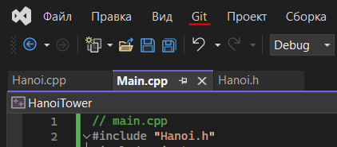

# HanoiTower

### Ханойская башня

Скопируйте себе удалённый репозиторий из github.

- Для этого в Visual Studio нажмите на вкладку `git`.



- Клонировать репозиторий.


- Скопируйте ссылку на репозиторий ([`https://github.com/Leonellos/HanoiTower.git`](https://github.com/Leonellos/HanoiTower.git)) и вставьте в строку.


- Укажите путь, где вам будет удобно сохранить копию репозитория и `клонируйте`.


- Если после копирования отроектся пустое окно, заходите в `обозреватель справа` и кликните на выпадающий список.


- Зайдите в `main.cpp`


- Вы увидите небольшой код, который запускает игру `Ханойская башня`.  


- Вы можете его запустить и задать, например, количество дисков, равное 3.  
Башня постепенно переложится с левой палки на правую. Это пример того, что вам необходимо будет реализовать.

Теперь можете закомментировать строку `game.solve()`.

Вам доступны следующие функции объекта `game`:

```cpp
game.setDelay(1000); 	// Устанавливает задержку между шагами в милисекундах.

game.display(); 		// Вывод на экран текущее состояние. Вам не нужно вызывать её каждый раз.

game.solve()			// Решить башню. Пример того, как это должно работать для произвольного числа дисков.

game.moveDisk(0, 1)		// Передвинуть диск с первого штыка (0) на второй (1). Всего их три - 0, 1, 2.
```

Для решения задачи вам нужна только функция `moveDisk()`. Обратите внимание, что если вы попытаетесь положить больший диск на меньший, вылезет ошибка. В случае, если попытаетесь переложить с пустого штыка на другой, тоже будет ошибка. Ну и штыков всего три:
- Первый (0)
- Второй (1)
- Третий (2).

Если попытаетесь передать другой индекс, тоже будет ошибка.

Таким образом, вам нужно придумать, по какой логике перемещать диски, чтобы переложить их по правилам с первого на третий штык.
Для передвижения дисков пользуйтесь функцией `moveDisk()`. Можете создавать любые переменные и функции, которые вам могут понадобиться для решения задачи. Главное - продемонстрировать, как вы это делаете. Помните, что диском может быть как 3, так и 4, 5, 6, ... - произвольное количество. Начните со случая для трёх и смотрите, будет ли что-то меняться в вашей логике.

__И не подглядывайте в `game.solve()` до самостоятельного решения__

**Удачи!**
